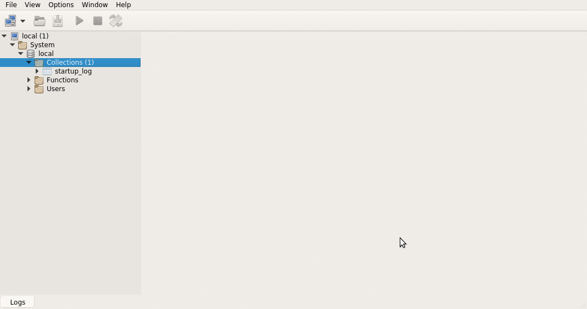

# Equipos de fútbol - Persistencia en MongoDB

## Objetivo
Testea el mapeo de una [aplicación de planteles de equipos de fútbol](http://ddsutn.com.ar/material/guia-de-ejercicios/guia-modelado-datos/nosql_plantelesfutbol) con MongoDB. 

## Modelo
La base de datos se estructura en un documento jerárquico:

* equipo 
 * jugadores

## Instalación
Antes de correr los test, tenés que instalar una base de datos MongoDB y levantar el server
(ejecutable mongod, en Linux sudo service mongod start). 

En la carpeta [scripts](scripts) vas a encontrar dos archivos:

* [Script Jugadores](scripts/Script Jugadores.txt) para ejecutarlo en el shell de MongoDB (ejecutable mongo). Este script inserta datos de varios equipos de fútbol con sus jugadores.
* [Queries Jugadores](scripts/Queries Jugadores.txt) con queries de ejemplo para probar directamente en el shell.

Acá te mostramos cómo correr los scripts con [Robomongo](https://robomongo.org/) un cliente MongoDB con algunas prestaciones gráficas:

Luego sí, podés correr los tests del proyecto Xtend, que testea

* que Palermo no está en el plantel de Boca del juego de datos
* que Riquelme sí está en el plantel de Boca del juego de datos
* que hay dos jugadores que comienzan con "Casta" (Castagno de Tigre y Dino Castaño de Boca)

## Proyecto
El proyecto base de Xtend está usando directamente el driver Java que provee MongoDB.

